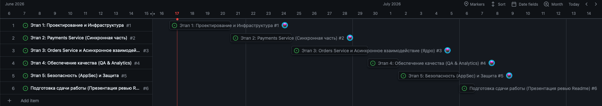
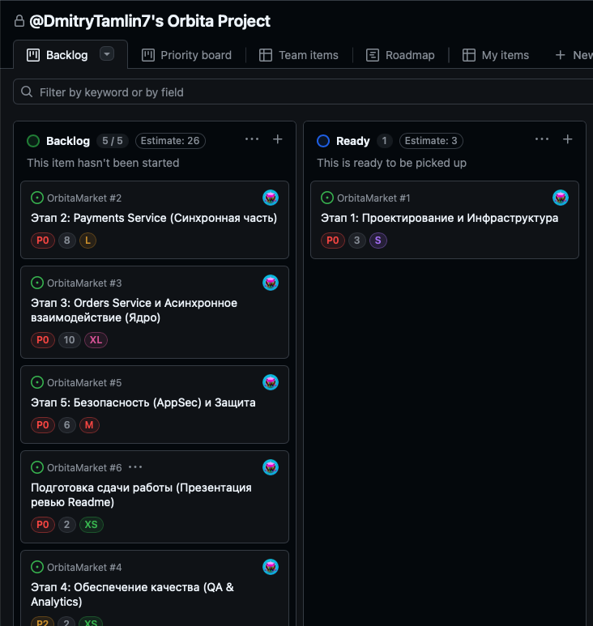

**Цель проекта:**

Спроектировать и разработать отказоустойчивое микросервисное ядро платформы OrbitaMarket для приема заказов на спутниковые продукты и консистентного биллинга в геокредитах при высоких нагрузках.

**Стейкхолдеры:**

**Операторы ДЗЗ (Дистанционного зондирования Земли):** поставщики исходных спутниковых данных.
**Аналитические компании (B2B):** основные потребители архивных снимков и заказчики нового мониторинга.
**Внутренние команды:** менеджеры платформы и аналитики, которым нужна статистика продаж.

---

### **Roadmap разработки**

  
   
  <i>Рисунок 1. Выстраивание роадмапа на GitHub Projects.</i>

Разбиваем работу на понятные спринты. Двигаемся по приоритетам.

**Этап 1: Проектирование и Инфраструктура**

* Отрисовка архитектурных диаграмм C4 (уровни C1 Context и C2 Container).
* Настройка `docker-compose.yml` для поднятия всего проекта одной командой.
* Подключение баз данных PostgreSQL (отдельные схемы для каждого сервиса) и брокера сообщений Kafka.
* Инициализация API Gateway для маршрутизации HTTP-запросов (`/payments/` и `/orders/`) и проброса заголовка `X-User-Id`.

**Этап 2: Payments Service (Синхронная часть)*

* Разработка REST API: идемпотентное создание счета, пополнение баланса (`/top-up`) и получение текущего состояния.
* Реализация безопасной обработки конкурентных запросов к балансу (через Optimistic Locking/CAS или блокировку на уровне строки в транзакции).
* Настройка стандартизированной обработки HTTP-ошибок (`INVALID_AMOUNT`, `ACCOUNT_ALREADY_EXISTS`, и т.д.).

**Этап 3: Orders Service и Асинхронное взаимодействие (Ядро)**

* Разработка REST API: создание заказа типа `ARCHIVE`, получение списка заказов пользователя и деталей конкретного заказа.
* Интеграция с Kafka: реализация паттерна Transactional Outbox в сервисе Orders для надежной публикации события `OrderPaymentRequested`.
* Реализация паттерна Transactional Inbox в сервисе Payments для обеспечения effectively exactly-once списания и защиты от двойного снятия средств.
* Публикация событий `OrderPaymentCompleted` / `OrderPaymentFailed` и соответствующее обновление статуса заказа (`PAID` или `PAYMENT_FAILED`).

**Этап 4: Обеспечение качества (QA & Analytics)**

* Написание SQL-скриптов (`docs/analytics.sql`) для аналитики: подсчет суммы купленных геокредитов и количества заказов по каждому `user_id`.
* Создание отдельного публичного репозитория для сквозных автотестов.
* Покрытие всех REST-эндпоинтов автотестами с последующей генерацией красивой отчетности в Allure.

**Этап 5: Безопасность (AppSec) и Защита**

* Интеграция статического анализа: сканирование исходного кода через Semgrep и поиск утечек секретов с помощью Gitleaks.
* Составление сводной таблицы триажа ИБ-находок (разделение на True Positive / False Positive с оценкой рисков).
* Сборка итоговой презентации (.pdf) с описанием архитектуры, решенных проблем ИБ и подготовка демо оплаты для защиты.

**Расстановка StoryPoint задачам**

  
   
  <i>Рисунок 2. Присваивание Story Points и приоритета задачам на GitHub Projects.</i>

