# 📊 Архитектура распределенной микросервисной системы OrbitaMarket

🚀 **Выпускной проект: Высоконагруженная e-commerce инфраструктура с асинхронным событийно-ориентированным взаимодействием, встроенным многоуровневым кэшированием и автоматизированным аудитом информационной безопасности.**


---

## 📝 1. Подробное описание проделанной работы

Реализована  отказоустойчивая распределенная экосистема **OrbitaMarket**, автоматизирующая сквозной процесс обработки торговых сделок и проведения платежей (биллинга) в режиме реального времени.

Архитектура системы опирается на принципы слабой связанности (Loose Coupling), транзакционной целостности на уровне отдельных сервисов (Local ACID) и гарантированной обработки сообщений брокера (Idempotent Consumer).

### Функциональные компоненты разработанной архитектуры:

**1. `api-gateway` (Spring Cloud Gateway)**  
Центральный маршрутизатор и единая точка входа (Reverse Proxy) для клиентских приложений.
* Инкапсулирует топологию внутренней сети проекта, динамически перенаправляя входящий трафик на соответствующие бизнес-сервисы.
* На уровне конфигурации десериализатора интегрирован механизм Jackson polymorphic JSON type resolution, обеспечивающий безопасный синтаксический разбор и маршрутизацию динамических полезных нагрузок (payload) без потери метаданных типов.
---


**2. `payments-service` (Сервис процессинга и биллинга)** Изолированный финансовый домен системы, отвечающий за ведение счетов пользователей и обеспечение транзакционной строгости.

* Асинхронно потребляет события из брокера сообщений через `@KafkaListener`.
* **Системная идемпотентность и защита от Double Spending:** В отличие от классических схем с генерацией временных токенов на клиенте, в OrbitaMarket сквозная идемпотентность реализована на системном уровне. В качестве естественного ключа дедупликации выступает сам уникальный идентификатор заказа (`orderId`), передаваемый внутри Kafka-события.
* При обработке входящего ивента сервис выполняет атомарный пре-чек через выделенный репозиторий дедупликации `ProcessedOrderRepository` с помощью метода `existsById(event.orderId())`. Если из-за сетевых ретрансмиссий брокера или повторных отправок (At-Least-Once семантика) событие приходит дубликатом, оно мгновенно отбрасывается, предотвращая повторное списание денежных средств со счета пользователя.

**### Внутренняя логика и управление состоянием в `payments-service`

Взаимодействие компонентов платежного сервиса (СУБД PostgreSQL, кэш-слой Redis) и логика изменения состояний сущностей при выполнении бизнес-операций устроены следующим образом:

**1. Автоматическая инициализация финансового кошелька**
При первом обращении пользователя к платежному контуру OrbitaMarket система изолированно создает для него персональный расчетный счет. В этот момент СУБД PostgreSQL генерирует уникальный UUID записи, связывает его со строковым идентификатором `userId` из заголовка и жестко выставляет стартовый баланс внутренних единиц (`geocredits`) в значение `0`.

<p align="center">
  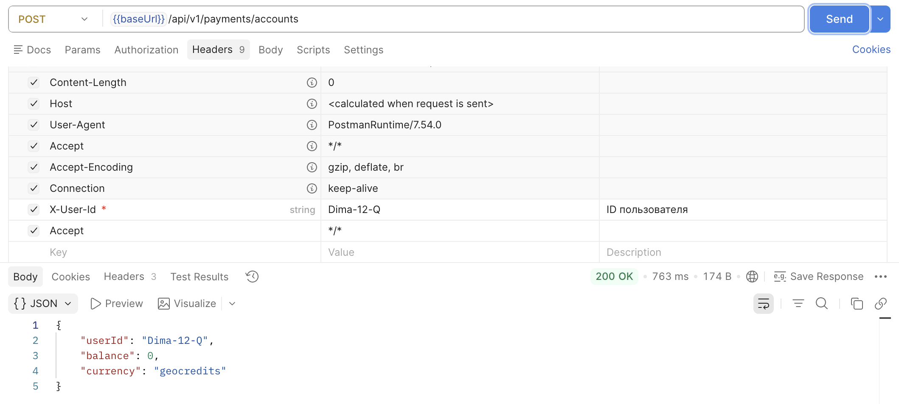
  <br>
  <i>Рисунок 1. Структура созданного кошелька пользователя с базовым нулевым балансом geocredits.</i>
</p>

---

**2. Транзакционное изменение баланса (Пополнение счета)**
Процесс внесения депозита спроектирован как атомарная транзакция. Сервис проверяет входящую сумму на соответствие бизнес-правилам. При фиксации нового объема средств в PostgreSQL параллельно срабатывает механизм очистки распределенного кэша: аннотация `@CacheEvict` принудительно удаляет старый снимок данных, чтобы исключить чтение неактуальной информации.

<p align="center">
  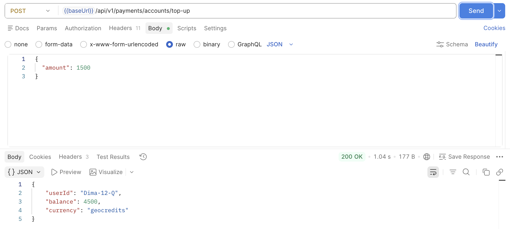
  <br>
  <i>Рисунок 2. Обновление баланса в СУБД и синхронный сброс закэшированного значения.</i>
</p>

---

**3. Чтение остатка средств и работа кэш-слоя (Паттерн Cache-Aside)**
Для минимизации задержек и снижения нагрузки на реляционную базу данных чтение текущего баланса оптимизировано с помощью резидентной памяти. Если данные запрашиваются впервые после сброса, система считывает состояние кошелька из PostgreSQL и прозрачно сохраняет его по ключу `userId`. Все последующие аналогичные запросы обрабатываются со скоростью $O(1)$ напрямую из оперативной памяти кэша, вообще не затрагивая СУБД.

<p align="center">
  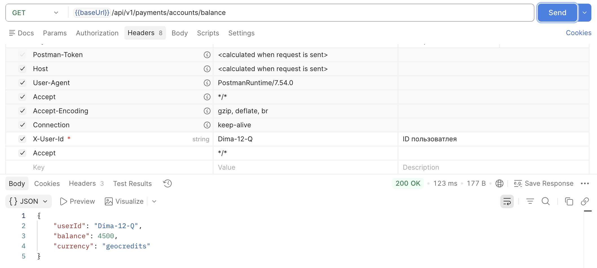
  <br>
  <i>Рисунок 3. Высокопроизводительное извлечение текущего финансового состояния кошелька из оперативной памяти.</i>
</p>

**3. Мониторинг жизненного цикла и конечный автомат состояний (Order Status)**
Каждая заявка на космическую съемку имеет строго регламентированный жизненный цикл, контролируемый внутренним конечным автоматом. После создания заказ переходит в статус первичного ожидания оплаты (`PENDING_PAYMENT`). Как только асинхронный `OrderPaymentListener` вычитывает из брокера Kafka успешное событие от биллинга (`payment-completed-events`), статус транзакционно обновляется (например, на `PAID` или `PROCESSING`). Запрос этого эндпоинта позволяет в реальном времени отслеживать текущую фазу обработки полетного задания или готовность архивных снимков.

<p align="center">
  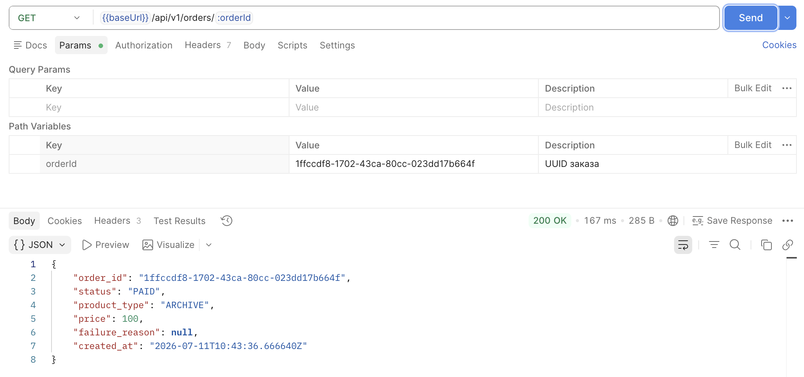
  <br>
  <i>Рисунок 3. Просмотр детальной информации по конкретному UUID заказа с актуальным статусом обработки в контуре.</i>
</p>

**4. Системная идемпотентность и защита от дублирования аккаунтов**
Архитектура сервиса устойчива к повторным вызовам инициализации, что критично при сетевых сбоях. Если система получает команду создать счет для пользователя, который уже присутствует в платежном домене, она защищает базу данных от дублирования записей и ошибок нарушения уникальности индексов. Слой бизнес-логики обнаруживает кошелек, фиксирует это событие в логах (`log.info("Аккаунт есть выдаем его")`) и безопасно возвращает вызывающему компоненту параметры существующего аккаунта со всем ранее накопленным балансом.

<p align="center">
  
  <br>
  <i>Рисунок 4. Поведение системы при повторном запросе: безопасный возврат текущих данных без изменения состояния БД.</i>
</p>


**3. `order-service` (Сервис управления заказами)** Компонент оркестрации жизненного цикла сделок и учета торговых операций с данными ДЗЗ (Дистанционного Зондирования Земли).

* **Входной контроль и идентификация:** Сервис принимает запросы, прошедшие жесткую валидацию на уровне `api-gateway`. Gateway строго контролирует наличие авторизационного заголовка `X-User-Id` (а также его вариаций `X-User_id` / `x-user-id`). В случае отсутствия заголовка сквозная цепочка блокируется на входе с генерацией ошибки `400 Bad Request` и системным сообщением:
  `Header X-User_id NOT FOUND`

* **Полиморфный Payload:** Внутри тела запроса (`request body`) структура полезной нагрузки является динамической и зависит от типа целевого продукта (`product_type`) и режима съемки. Благодаря встроенному механизму Jackson-полиморфизма, сервис корректно распределяет десериализацию:
* продуктов класса **ARCHIVE** **TASKING** и **MONITORING** валидируются пространственные полигоны (AOI), временные окна и периодичность (cadence).

* **Изоляция в тестировании:** В автоматизированных end-to-end сценариях (REST Assured / Allure) для обеспечения полной изоляции транзакций и исключения конфликтов состояния данных, идентификаторы пользователей генерируются динамически по маске `AT-[timestamp]`, что гарантирует бесконфликтное выполнение тестов. Первичные сущности заказов сохраняются в реляционную базу данных **PostgreSQL**.
* Выступает в роли издателя (Kafka Producer), асинхронно публикуя события инициализации оплаты в топик брокера сообщений.

### Внутренняя логика и управление жизненным циклом в `orders-service`

Доменная логика обработки заказов на продукты дистанционного зондирования Земли (ДЗЗ), механизмы работы с полиморфными данными и ведение конечного автомата состояний устроены следующим образом:

**1. Регистрация заказа и фиксация полиморфной полезной нагрузки**
Когда клиент отправляет запрос на создание заказа, сервис динамически разбирает входящие параметры. В зависимости от типа продукта (`ARCHIVE`, `TASKING`, `MONITORING`), Jackson через механизм *External Property Binding* сопоставляет данные с нужным классом реализации. В базе данных PostgreSQL вся специфичная геоинформация (координаты области интереса AOI, параметры съемочной аппаратуры) сохраняется в одну оптимизированную колонку в формате **JSONB**. Одновременно с этим в рамках единой ACID-транзакции создается запись в таблице Outbox для последующей публикации события оплаты в Kafka.

<p align="center">
  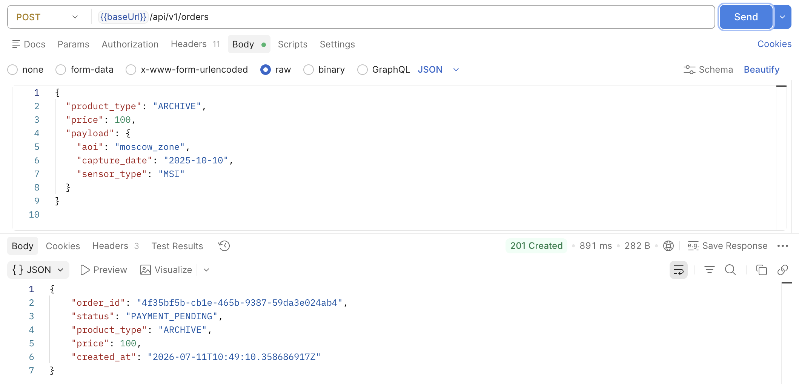
  <br>
  <i>Рисунок 5. Успешная регистрация космического заказа с сохранением динамического JSONB-payload.</i>
</p>

---

**2. Агрегация и извлечение истории заказов пользователя**
Для отображения личного кабинета или предоставления истории запросов сервис реализует эффективную выборку из реляционной СУБД. По переданному из API Gateway идентификатору `userId` система собирает все связанные записи. Благодаря оптимизированному индексированию колонки `user_id` в PostgreSQL, выборка выполняется моментально, возвращая клиенту структурированный массив данных с актуальными статусами и исторической стоимостью каждого пакета мониторинга.

<p align="center">
  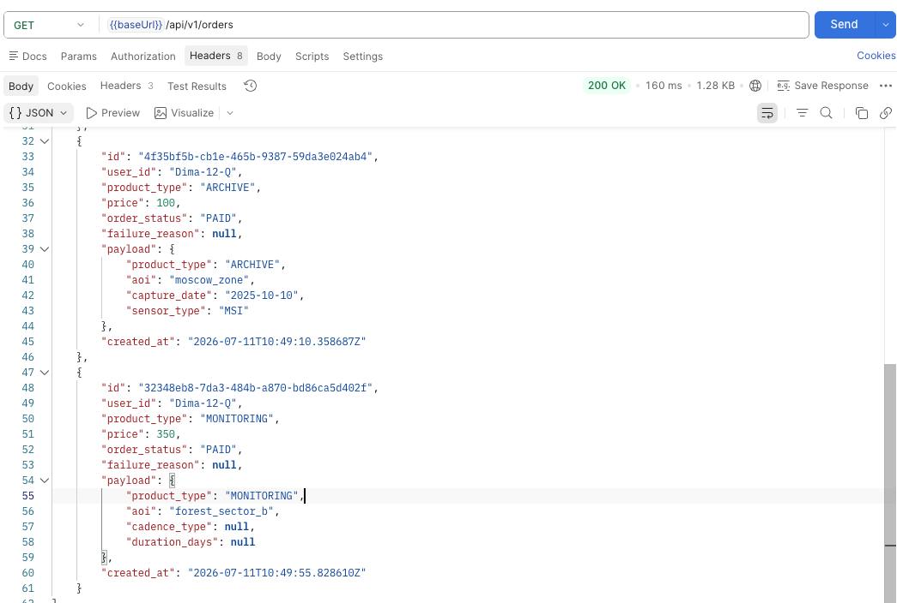
  <br>
  <i>Рисунок 6. Структура ответа при запросе полного списка целевых заказов, закрепленных за конкретным пользователем.</i>
</p>

---

## 📡 2. Реестр брокера сообщений и контракты (Event Registry)

В основе межсервисной коммуникации проекта лежит событийно-ориентированная архитектура (Event-Driven Architecture). В качестве центральной шины данных используется кластер **Apache Kafka**. Передача данных осуществляется строго в асинхронном режиме, что исключает блокировки потоков (Thread Blocking) и повышает общую пропускную способность (Throughput) системы.


### Топология топиков и маршрутизация

Маршрутизация сообщений (Partitioning) внутри топиков осуществляется по ключу `orderId`, что гарантирует строгий порядок (Strict Ordering) обработки событий, относящихся к одному конкретному заказу.

| Наименование топика (Topic) | Продюсер (Издатель) | Консьюмер (Группа) | Ключ маршрутизации | Описание бизнес-процесса |
| :--- | :--- | :--- | :--- | :--- |
| **`payment-requests-topic`** | `order-service` | `payments-service` <br> *(group: payment-group)* | `orderId` (UUID) | Инициализация процесса списания средств после создания нового заказа. |
| **`payment-completed-topic`** | `payments-service` | `order-service` <br> *(group: order-group)* | `orderId` (UUID) | Подтверждение успешной транзакции и перевод заказа в статус `PAID`. |
| **`payment-failed-topic`** | `payments-service` | `order-service` <br> *(group: order-group)* | `orderId` (UUID) | Уведомление об отказе биллинга (нехватка средств). Статус заказа — `FAILED`. |

<p align="center">
  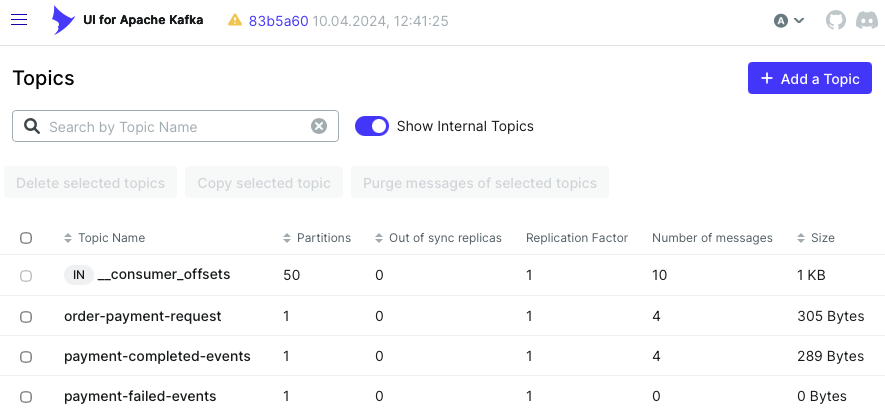
  <br>
  <i>Рисунок 7. Панель мониторинга брокера сообщений: распределение топиков Apache Kafka.</i>
</p>

### Спецификация контрактов данных (Payload Contracts)

Обмен сообщениями стандартизирован. В системе реализован подход **Event-Carried State Transfer**, при котором событие содержит все необходимые данные для обработки.

**`OrderPaymentRequestedEvent`** (Запрос на оплату)
```json
{
  "eventId": "f47ac10b-58cc-4372-a567-0e02b2c3d479",
  "orderId": "d290f1ee-6c54-4b01-90e6-d701748f0851",
  "userId": "Dima-01",
  "amount": 450.00,
  "timestamp": "2026-06-15T10:23:45.123Z"
}

```

**`OrderPaymentCompletedEvent`** (Успешная оплата)

```json
{
  "eventId": "a1b2c3d4-e5f6-7a8b-9c0d-1e2f3a4b5c6d",
  "orderId": "d290f1ee-6c54-4b01-90e6-d701748f0851",
  "userId": "Dima-01",
  "amount": 1500,
  "newBalance": 3500
}

```

**`OrderPaymentFailedEvent`** (Ошибка оплаты)

```json
{
  "eventId": "c8a4d1a4-88cc-4122-a567-3e02b2c3d888",
  "orderId": "d290f1ee-6c54-4b01-90e6-d701748f0851",
  "userId": "Dima-01",
  "failureReason": "INSUFFICIENT_BALANCE",
  "timestamp": "2026-06-15T10:24:01.444Z"
}

```

### Семантика доставки (Delivery Guarantees & Idempotency)

В системе реализована семантика доставки сообщений **At-Least-Once** (Хотя бы один раз). Для нивелирования побочных эффектов (возникновения дубликатов при сетевых ретрансмиссиях) на стороне `payments-service` внедрен паттерн **Idempotent Consumer**. Атомарная проверка уникальности транзакции реализована через `ProcessedOrderRepository`, что полностью исключает архитектурную уязвимость *Double Spending* (двойного списания).

<p align="center">
  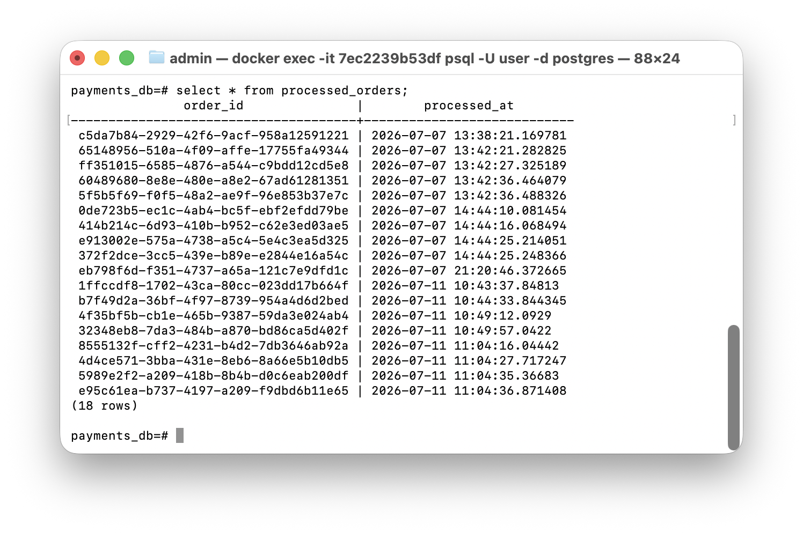
  <br>
  <i>Рисунок 8. Таблица Processed_orders.</i>
</p>


## 🔄 3. Технические сценарии и взаимодействие (Data Flow)

Пошаговый технический сценарий выполнения сквозной бизнес-операции:

1. **Запрос на покупку:** Пользователь инициирует транзакцию. `api-gateway` проксирует HTTP POST-запрос на `order-service`.
2. **Фиксация намерения:** `order-service` генерирует `UUID` заказа, сохраняет его в PostgreSQL со статусом `PENDING` и мгновенно возвращает клиенту ответ `201 Created`.
3. **Публикация события:** `order-service` отправляет `OrderPaymentRequestedEvent` в Kafka.
4. **Атомарная проверка идемпотентности:** `payments-service` считывает событие. Выполняется проверка `processedOrderRepository.existsById()`. Если заказ уже обрабатывался (дубликат), ивент отбрасывается.
5. **Процессинг баланса:**
* *Успех:* Баланс уменьшается, в `ProcessedOrderRepository` вносится запись, в Кафку отправляется `OrderPaymentCompletedEvent`.
* *Отказ:* Изменение баланса блокируется, генерируется `OrderPaymentFailedEvent`.
6. **Финализация транзакции:** `order-service` принимает результирующий ивент и переводит статус заказа в `PAID` или `FAILED`.

---

## 🗺️ 4. Модели и диаграммы системы

### Диаграмма последовательности (Sequence Diagram)

Интерактивная диаграмма, детально описывающая логику межсервисного асинхронного взаимодействия.

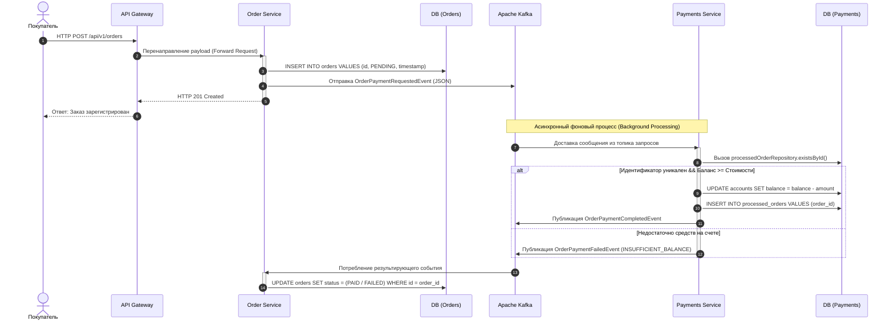

---

## ⚡ 5. Оптимизация производительности: Слой кэширования

С целью обеспечения соответствия архитектуры требованиям концепции **Highload**, внедрен слой резидентного кэширования на базе абстракции **Spring Cache**. Внедрение устранило бутылочное горлышко (I/O Bottleneck) СУБД.

* **Домен Финансов (`payments-service`):** Реализован паттерн **Cache-Aside**. Запрос баланса (`@Cacheable`) извлекается из RAM. При мутации баланса через оплату или пополнение применяется директива `@CacheEvict`, атомарно вытесняя устаревший ключ и гарантируя строгую консистентность (*Strong Consistency*).
* **Домен Заказов (`order-service`):** При создании заказа метод использует `@CachePut`, осуществляя упреждающий прогрев кэша (*Pre-heating*). При получении финальных статусов из брокера, слушатели вызывают `@CacheEvict`, заставляя систему обновить кэш при следующем чтении.

---

## 🛡️ 6. Информационная безопасность и аудит инфраструктуры (DevSecOps)

Архитектура распределенной системы OrbitaMarket спроектирована с соблюдением жестких стандартов ИБ. Проверка исходного кода и конфигурационных файлов оркестрации (IaC) автоматизирована с помощью специализированных сканеров безопасности.

### 1. Контроль утечки секретов (Gitleaks)
На ранних этапах разработки статический сканер **Gitleaks** зафиксировал коммит с жестко закодированным токеном (`generic-api-key`) в локальных отчетах. 

<p align="center">
  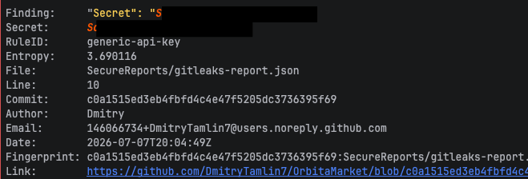
  <br>
  <i>Рисунок 9. Обнаружение чувствительных данных в истории коммитов утилитой Gitleaks.</i>
</p>

**Компенсирующие меры:**
* Обнаруженный ключ был немедленно удален из коммитов
* Файлы конфигураций очищены от жестких строк, а передача всех чувствительных токенов и паролей полностью переведена на динамические переменные окружения (`environment` в Docker Compose), считываемые из изолированных локальных `.env`-файлов, добавленных в `.gitignore`.

<p align="center">
  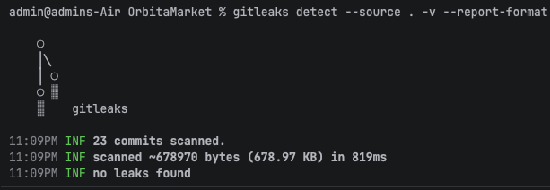
  <br>
  <i>Рисунок 10. Отсутствие ключей и чувствительных данных.</i>
</p>

---

### 2. Статический анализ конфигураций IaC (Semgrep SAST)

При аудите файла `docker-compose.yml` анализатор **Semgrep** выявил критические уязвимости уровня **Blocking** (`writable-filesystem-service`). Сканер зафиксировал, что сервисы `postgres` и `kafka` запускались с перезаписываемой корневой файловой системой, что позволяло потенциальному вредоносному коду модифицировать файлы контейнера или загружать дополнительные payloads.

<p align="center">
  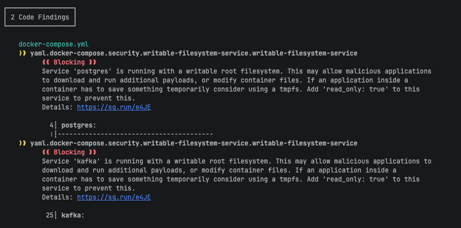
  <br>
  <i>Рисунок 11. Отчёт Semgrep: блокирующие предупреждения о writable root filesystem.</i>
</p>


**Решение и hardening:**

Обе уязвимости были полностью устранены без потери функциональности сервисов.

- **Postgres**:  
  Корневая файловая система переведена в режим `read_only: true`. Изменяемые директории (`/tmp`, `/var/run/postgresql` и др.) вынесены на `tmpfs`, а данные БД хранятся в постоянном volume.

- **Kafka**:  
  Перевод в `read_only: true` приводил к падению контейнера из-за попыток JVM и скриптов KRaft писать в `/opt/kafka/config`, `/opt/kafka/logs` и распаковывать native-библиотеки (`zstd-jni`).  
  Проблема решена путём целевого монтирования необходимых директорий через `tmpfs` (в оперативную память) и установки `KAFKA_COMPRESSION_TYPE: lz4` для совместимости с архитектурой **ARM64** (Apple Silicon).

<p align="center">
  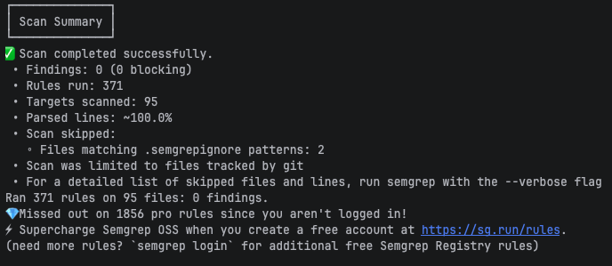
  <br>
  <i>Рисунок 12. Уязвимостей не найдено</i>
</p>


В результате инфраструктура теперь соответствует лучшим практикам безопасной контейнеризации:
- root filesystem доступен только на чтение;
- все изменения происходят либо в volumes, либо в tmpfs;
- Semgrep больше не выявляет блокирующих уязвимостей в `docker-compose.yml`.

---


## 🧪 7. Покрытие кода тестами (Unit Testing)

Надежность распределенной логики подтверждена пакетом модульных тестов на базе **JUnit 5** и **Mockito**.

В ходе рефакторинга тестового покрытия была устранена ошибка тестирования иммутабельных структур: Record-компоненты DTO (ивенты Кафки) проверяются на реальных инстансах данных. Покрыты тест-кейсы:

* Корректное списание средств, валидация математики и отправка `OrderPaymentCompletedEvent`.
* Логика нехватки денежных средств и статус `INSUFFICIENT_BALANCE`.
* Генерация исключений `EntityNotFoundException`.

---
