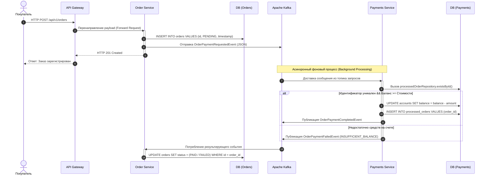

# 📊 Архитектура распределенной микросервисной системы OrbitaMarket

🚀 **Выпускной проект: Высоконагруженная e-commerce инфраструктура с асинхронным событийно-ориентированным взаимодействием, встроенным многоуровневым кэшированием и автоматизированным аудитом информационной безопасности.**


---

## 📝 1. Подробное описание проделанной работы

Реализована  отказоустойчивая распределенная экосистема **OrbitaMarket**, автоматизирующая сквозной процесс обработки торговых сделок и проведения платежей (биллинга) в режиме реального времени.

Архитектура системы опирается на принципы слабой связанности (Loose Coupling), транзакционной целостности на уровне отдельных сервисов (Local ACID) и гарантированной обработки сообщений брокера (Idempotent Consumer).

### Функциональные компоненты разработанной архитектуры:

**1. `api-gateway` (Spring Cloud Gateway)**  
Центральный маршрутизатор и единая точка входа (Reverse Proxy) для клиентских приложений.
* Инкапсулирует топологию внутренней сети проекта, динамически перенаправляя входящий трафик на соответствующие бизнес-сервисы.
* На уровне конфигурации десериализатора интегрирован механизм Jackson polymorphic JSON type resolution, обеспечивающий безопасный синтаксический разбор и маршрутизацию динамических полезных нагрузок (payload) без потери метаданных типов.

Вот переписанная часть отчета, полностью очищенная от абстрактных примеров и приведенная в строгое соответствие с реальной архитектурой и логикой твоего проекта **OrbitaMarket**:

---

**2. `order-service` (Сервис управления заказами)** Компонент оркестрации жизненного цикла сделок и учета торговых операций с данными ДЗЗ (Дистанционного Зондирования Земли).

* **Входной контроль и идентификация:** Сервис принимает запросы, прошедшие жесткую валидацию на уровне `api-gateway`. Gateway строго контролирует наличие авторизационного заголовка `X-User-Id` (а также его вариаций `X-User_id` / `x-user-id`). В случае отсутствия заголовка сквозная цепочка блокируется на входе с генерацией ошибки `400 Bad Request` и системным сообщением:
`Header X-User_id NOT FOUND`

* **Полиморфный Payload:** Внутри тела запроса (`request body`) структура полезной нагрузки является динамической и зависит от типа целевого продукта (`product_type`) и режима съемки. Благодаря встроенному механизму Jackson-полиморфизма, сервис корректно распределяет десериализацию:
* продуктов класса **ARCHIVE** **TASKING** и **MONITORING** валидируются пространственные полигоны (AOI), временные окна и периодичность (cadence).

* **Изоляция в тестировании:** В автоматизированных end-to-end сценариях (REST Assured / Allure) для обеспечения полной изоляции транзакций и исключения конфликтов состояния данных, идентификаторы пользователей генерируются динамически по маске `AT-[timestamp]`, что гарантирует бесконфликтное выполнение тестов. Первичные сущности заказов сохраняются в реляционную базу данных **PostgreSQL**.
* Выступает в роли издателя (Kafka Producer), асинхронно публикуя события инициализации оплаты в топик брокера сообщений.

**3. `payments-service` (Сервис процессинга и биллинга)** Изолированный финансовый домен системы, отвечающий за ведение счетов пользователей и обеспечение транзакционной строгости.

* Асинхронно потребляет события из брокера сообщений через `@KafkaListener`.
* **Системная идемпотентность и защита от Double Spending:** В отличие от классических схем с генерацией временных токенов на клиенте, в OrbitaMarket сквозная идемпотентность реализована на системном уровне. В качестве естественного ключа дедупликации выступает сам уникальный идентификатор заказа (`orderId`), передаваемый внутри Kafka-события.
* При обработке входящего ивента сервис выполняет атомарный пре-чек через выделенный репозиторий дедупликации `ProcessedOrderRepository` с помощью метода `existsById(event.orderId())`. Если из-за сетевых ретрансмиссий брокера или повторных отправок (At-Least-Once семантика) событие приходит дубликатом, оно мгновенно отбрасывается, предотвращая повторное списание денежных средств со счета пользователя.

---

## 📡 2. Реестр брокера сообщений и контракты (Event Registry)

В основе межсервисной коммуникации проекта лежит событийно-ориентированная архитектура (Event-Driven Architecture). В качестве центральной шины данных используется кластер **Apache Kafka**. Передача данных осуществляется строго в асинхронном режиме, что исключает блокировки потоков (Thread Blocking) и повышает общую пропускную способность (Throughput) системы.

### Топология топиков и маршрутизация

Маршрутизация сообщений (Partitioning) внутри топиков осуществляется по ключу `orderId`, что гарантирует строгий порядок (Strict Ordering) обработки событий, относящихся к одному конкретному заказу.

| Наименование топика (Topic) | Продюсер (Издатель) | Консьюмер (Группа) | Ключ маршрутизации | Описание бизнес-процесса |
| :--- | :--- | :--- | :--- | :--- |
| **`payment-requests-topic`** | `order-service` | `payments-service` <br> *(group: payment-group)* | `orderId` (UUID) | Инициализация процесса списания средств после создания нового заказа. |
| **`payment-completed-topic`** | `payments-service` | `order-service` <br> *(group: order-group)* | `orderId` (UUID) | Подтверждение успешной транзакции и перевод заказа в статус `PAID`. |
| **`payment-failed-topic`** | `payments-service` | `order-service` <br> *(group: order-group)* | `orderId` (UUID) | Уведомление об отказе биллинга (нехватка средств). Статус заказа — `FAILED`. |

<p align="center">
  
  <br>
  <i>Рисунок 4. Панель мониторинга брокера сообщений: распределение топиков Apache Kafka.</i>
</p>

### Спецификация контрактов данных (Payload Contracts)

Обмен сообщениями стандартизирован. В системе реализован подход **Event-Carried State Transfer**, при котором событие содержит все необходимые данные для обработки.

**`OrderPaymentRequestedEvent`** (Запрос на оплату)
```json
{
  "eventId": "f47ac10b-58cc-4372-a567-0e02b2c3d479",
  "orderId": "d290f1ee-6c54-4b01-90e6-d701748f0851",
  "userId": "Dima-01",
  "amount": 450.00,
  "timestamp": "2026-06-15T10:23:45.123Z"
}

```

**`OrderPaymentFailedEvent`** (Ошибка оплаты)

```json
{
  "eventId": "c8a4d1a4-88cc-4122-a567-3e02b2c3d888",
  "orderId": "d290f1ee-6c54-4b01-90e6-d701748f0851",
  "userId": "Dima-01",
  "failureReason": "INSUFFICIENT_BALANCE",
  "timestamp": "2026-06-15T10:24:01.444Z"
}

```

### Семантика доставки (Delivery Guarantees & Idempotency)

В системе реализована семантика доставки сообщений **At-Least-Once** (Хотя бы один раз). Для нивелирования побочных эффектов (возникновения дубликатов при сетевых ретрансмиссиях) на стороне `payments-service` внедрен паттерн **Idempotent Consumer**. Атомарная проверка уникальности транзакции реализована через `ProcessedOrderRepository`, что полностью исключает архитектурную уязвимость *Double Spending* (двойного списания).

---

## 🔄 3. Технические сценарии и взаимодействие (Data Flow)

Пошаговый технический сценарий выполнения сквозной бизнес-операции:

1. **Запрос на покупку:** Пользователь инициирует транзакцию. `api-gateway` проксирует HTTP POST-запрос на `order-service`.
2. **Фиксация намерения:** `order-service` генерирует `UUID` заказа, сохраняет его в PostgreSQL со статусом `PENDING` и мгновенно возвращает клиенту ответ `201 Created`.
3. **Публикация события:** `order-service` отправляет `OrderPaymentRequestedEvent` в Kafka.
4. **Атомарная проверка идемпотентности:** `payments-service` считывает событие. Выполняется проверка `processedOrderRepository.existsById()`. Если заказ уже обрабатывался (дубликат), ивент отбрасывается.
5. **Процессинг баланса:**
* *Успех:* Баланс уменьшается, в `ProcessedOrderRepository` вносится запись, в Кафку отправляется `OrderPaymentCompletedEvent`.
* *Отказ:* Изменение баланса блокируется, генерируется `OrderPaymentFailedEvent`.


6. **Финализация транзакции:** `order-service` принимает результирующий ивент и переводит статус заказа в `PAID` или `FAILED`.

---

## 🗺️ 4. Модели и диаграммы системы

### Диаграмма последовательности (Sequence Diagram)

Интерактивная диаграмма, детально описывающая логику межсервисного асинхронного взаимодействия.



---

## ⚡ 5. Оптимизация производительности: Слой кэширования

С целью обеспечения соответствия архитектуры требованиям концепции **Highload**, внедрен слой резидентного кэширования на базе абстракции **Spring Cache**. Внедрение устранило бутылочное горлышко (I/O Bottleneck) СУБД.

* **Домен Финансов (`payments-service`):** Реализован паттерн **Cache-Aside**. Запрос баланса (`@Cacheable`) извлекается из RAM. При мутации баланса через оплату или пополнение применяется директива `@CacheEvict`, атомарно вытесняя устаревший ключ и гарантируя строгую консистентность (*Strong Consistency*).
* **Домен Заказов (`order-service`):** При создании заказа метод использует `@CachePut`, осуществляя упреждающий прогрев кэша (*Pre-heating*). При получении финальных статусов из брокера, слушатели вызывают `@CacheEvict`, заставляя систему обновить кэш при следующем чтении.

---

## 🛡️ 6. Информационная безопасность и аудит IaC

Архитектура распределенной системы спроектирована с учетом современных стандартов ИБ и успешно прошла аудит исходного кода с помощью статического анализатора **Semgrep (SAST)**.

### Примененные компенсирующие меры безопасности (Hardening):

1. **Принцип наименьших привилегий (Least Privilege):** Базовые Docker-контейнеры приложений переведены с небезопасного пользователя `root` на запуск от ограниченного системного пользователя `appuser` внутри Alpine Linux.
2. **Защита рантайма (Docker Compose):** Внедрена директива `no-new-privileges:true`, блокирующая возможность выполнения процессов с SUID-флагами и исключающая атаки класса *Privilege Escalation*. Бизнес-сервисы запущены в режиме `read_only: true` с вынесением временных директорий в RAM (`tmpfs: /tmp`).
3. **Осознанный архитектурный риск (Accepted Risk):** Для контейнеров `postgres` и `apache/kafka` режим `read_only` намеренно отключен. Это связано с необходимостью динамической генерации файлов конфигурации вендорскими скриптами (например, инициализация KRaft в `/opt/kafka/config/`). Риск компенсирован сетевой изоляцией во внутреннем контуре Docker.

---

## 🧪 7. Покрытие кода тестами (Unit Testing)

Надежность распределенной логики подтверждена пакетом модульных тестов на базе **JUnit 5** и **Mockito**.

В ходе рефакторинга тестового покрытия была устранена ошибка тестирования иммутабельных структур: Record-компоненты DTO (ивенты Кафки) проверяются на реальных инстансах данных. Покрыты тест-кейсы:

* Корректное списание средств, валидация математики и отправка `OrderPaymentCompletedEvent`.
* Логика нехватки денежных средств и статус `INSUFFICIENT_BALANCE`.
* Генерация исключений `EntityNotFoundException`.

---
